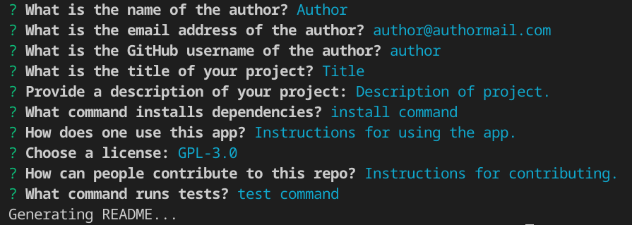

# Professional README Generator
[](https://opensource.org/licenses/MIT)
## Description:
Generates a README file based on input from the user in response to questions posed by inquirer.js on the command line.



## Table of Contents:
* [Installation](#installation)
* [Usage](#usage)
* [License](#license)
* [Contributing](#contributing)
* [Tests](#tests)
* [Questions](#questions)

### Installation
Clone the repo then run this command within the repo directory:

```npm install```

### Usage
Run ```node index.js``` within the repo directory. Answer the questions and a .md file named newlyGeneratedREADME will be created within the repo directory.

### License
This repository is licensed under the [MIT](https://opensource.org/licenses/MIT) license.

### Contributing
No contributions at this time.

### Tests
None.

### Questions
If you have any questions, head to my [GitHub](https://github.com/DandyCodes) or send me an email at jdabarker@gmail.com.